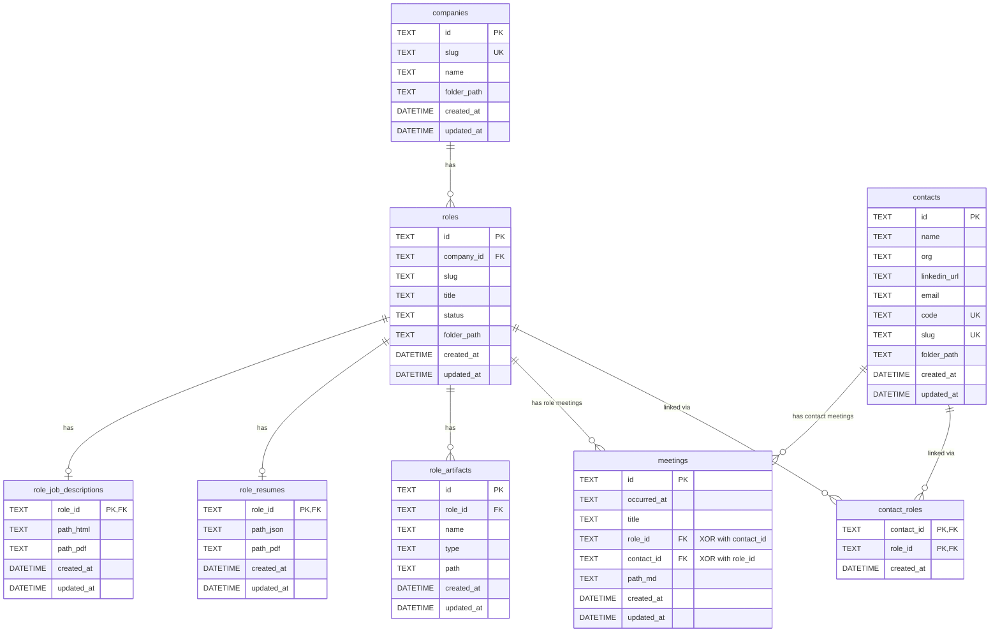

# Job Application Notes Tracker — Architecture Guide

This document provides a comprehensive overview of the repository structure, architecture, domain models, and design values for agents continuing work on this codebase.

## Purpose

A local-only Go web application for storing and retrieving job application notes and artifacts. Designed for personal use with hybrid storage: human-readable files on disk and SQLite for metadata/search.

## Quick Start

```bash
# Run the server (binds to 127.0.0.1:8080 by default)
go run ./cmd/server

# Run tests
go test ./...

# Access from other devices on LAN
JOBTRACKER_ADDR=0.0.0.0:8080 go run ./cmd/server
```

## Directory Structure

```tree
job-hunter-v2/
├── cmd/
│   └── server/
│       └── main.go              # Application entry point, dependency wiring
├── internal/
│   ├── app/                     # Application services (business logic)
│   │   ├── company_service.go   # Company + Role operations
│   │   ├── contact_service.go   # Contact operations + role linking
│   │   ├── meeting_service.go   # Role and contact meeting operations
│   │   ├── jd_service.go        # Job description attachment
│   │   ├── resume_service.go    # Resume attachment
│   │   ├── artifact_service.go  # Generic role artifact management
│   │   └── export_service.go    # JSON export (uses ports.ExportQuerier)
│   ├── config/
│   │   └── config.go            # Environment-based configuration
│   ├── domain/
│   │   ├── types.go             # Domain entities, RoleStatus enum, ArtifactType enum
│   │   ├── shortid.go           # 8-char ID generator (Crockford Base32)
│   │   └── slug.go              # Slugify helpers
│   ├── http/
│   │   ├── router.go            # Chi router setup, route definitions
│   │   ├── handlers.go          # Handlers struct, response types, shared helpers
│   │   ├── handlers_companies.go # Company + role API and HTML handlers
│   │   ├── handlers_contacts.go  # Contact API and HTML handlers
│   │   ├── handlers_roles.go     # Role detail, JD, resume, artifact, meeting handlers
│   │   ├── handlers_export.go    # Export API and HTML handlers
│   │   ├── behavioral_test.go   # End-to-end tests using httptest
│   │   └── views/
│   │       ├── views.go         # Template parsing and rendering
│   │       ├── layout.html      # Base HTML layout with nav + CSS
│   │       ├── companies.html   # Company list page
│   │       ├── company.html     # Company detail page
│   │       ├── role.html        # Role detail page
│   │       ├── contacts.html    # Contact list page
│   │       ├── contact.html     # Contact detail page
│   │       └── jd_viewer.html   # JD viewer page (sandboxed iframe)
│   ├── infra/
│   │   ├── filestore/
│   │   │   └── filestore.go     # Filesystem operations (implements ports.FileStore)
│   │   └── sqlite/
│   │       ├── db.go            # Database connection + migration runner
│   │       ├── company_repo.go  # CompanyRepository implementation
│   │       ├── role_repo.go     # RoleRepository implementation
│   │       ├── contact_repo.go  # ContactRepository implementation
│   │       ├── meeting_repo.go    # MeetingRepository implementation
│   │       ├── jd_repo.go       # JobDescriptionRepository implementation
│   │       ├── resume_repo.go   # ResumeRepository implementation
│   │       ├── artifact_repo.go # ArtifactRepository implementation
│   │       ├── export_querier.go # ExportQuerier implementation (implements ports.ExportQuerier)
│   │       └── migrations/
│   │           ├── 001_initial.go                    # companies, roles
│   │           ├── 002_contacts_threads_meetings.go  # contacts, threads, meetings (historical)
│   │           ├── 003_thread_roles.go               # thread_roles join table (historical)
│   │           ├── 004_job_descriptions.go           # role_job_descriptions
│   │           ├── 005_role_status.go                # role status column
│   │           ├── 006_meetings_v2.go                # meetings table (created as meetings_v2, renamed in 017)
│   │           ├── 007_thread_code_slug.go           # thread code/slug columns (historical)
│   │           ├── 008_role_resumes.go               # role_resumes table
│   │           ├── 009_role_artifacts.go             # role_artifacts table
│   │           ├── 010_artifact_html_type.go         # html artifact type
│   │           ├── 011_artifact_markdown_type.go     # markdown artifact type
│   │           ├── 012_artifact_png_type.go          # png artifact type
│   │           ├── 013_artifact_file_type.go         # file artifact type
│   │           ├── 014_contact_infrastructure.go     # contact_roles, meetings contact_id column
│   │           ├── 015_drop_thread_dependencies.go   # remove thread_id from meetings, drop thread_roles
│   │           ├── 016_drop_legacy_tables.go         # drop legacy meetings, meeting_threads, threads tables
│   │           └── 017_rename_meetings_v2.go         # rename meetings_v2 → meetings
│   ├── ports/
│   │   ├── repositories.go      # Repository interfaces
│   │   ├── filestore.go         # FileStore interface
│   │   └── export.go            # ExportQuerier interface (decouples export_service from sqlite)
│   └── testharness/
│       └── harness.go           # Test utilities (temp DB, temp repo, HTTP client)
├── data/                        # Filesystem storage (gitignored except structure)
│   ├── companies/
│   │   └── {company-slug}/
│   │       ├── company.md       # Company notes
│   │       └── roles/
│   │           └── {role-slug}/
│   │               ├── job.html # Job description HTML
│   │               ├── job.pdf  # Job description PDF
│   │               ├── resume/
│   │               │   ├── resume.jsonc  # Resume data (JSON with Comments)
│   │               │   └── resume.pdf   # Resume PDF
│   │               ├── artifacts/
│   │               │   └── {name}.{ext} # Generic role artifacts
│   │               └── meetings/
│   │                   └── YYYY-MM-DD_title_<8-char-id>.md  # Role meetings
│   └── contacts/
│       └── {contact-slug}-{CODE8}/    # e.g., jane-smith-6PPEZJPW
│           └── YYYY-MM-DD_title_<8-char-id>.md  # Contact meetings
└── db/
    ├── index.sqlite             # SQLite database
    └── export.json              # Deterministic export
```

## Architecture

### Layered Architecture (Hexagonal/Ports & Adapters)

```diagram
┌─────────────────────────────────────────────────────────────┐
│                      HTTP Layer                             │
│  router.go, handlers*.go, views/                            │
│  - Route definitions                                        │
│  - Request parsing, response rendering                      │
│  - Calls app services                                       │
└─────────────────────────────────────────────────────────────┘
                              │
                              ▼
┌─────────────────────────────────────────────────────────────┐
│                    Application Layer                        │
│  internal/app/*_service.go                                  │
│  - Business logic orchestration                             │
│  - Uses ports interfaces (not concrete implementations)     │
│  - Coordinates repos + filestore                            │
└─────────────────────────────────────────────────────────────┘
                              │
                              ▼
┌─────────────────────────────────────────────────────────────┐
│                       Ports Layer                           │
│  internal/ports/                                            │
│  - Repository interfaces                                    │
│  - FileStore interface                                      │
│  - ExportQuerier interface                                  │
│  - Decouples app from infrastructure                        │
└─────────────────────────────────────────────────────────────┘
                              │
                              ▼
┌─────────────────────────────────────────────────────────────┐
│                  Infrastructure Layer                       │
│  internal/infra/sqlite/     internal/infra/filestore/       │
│  - SQLite repository impls  - Filesystem operations         │
│  - ExportQuerier impl       - Creates folders, files        │
│  - Migrations               - Reads frontmatter             │
└─────────────────────────────────────────────────────────────┘
```

### Key Boundaries

| Layer | Responsibility | What it DOES NOT do |
| ------- | --------------- | --------------------- |
| `http/handlers*` | Parse requests, call services, render responses | Raw SQL, file I/O |
| `app/*_service` | Business logic, validation, orchestration | HTTP concerns, raw SQL |
| `ports/` | Define interfaces | Implementation details |
| `infra/sqlite/` | SQL queries, DB operations | Business logic, HTTP |
| `infra/filestore/` | File operations | Business logic, DB access |

### HTTP Handler Split

The HTTP layer is split across four focused files (plus router and shared types):

| File | Contents |
| ----- | -------- |
| `handlers.go` | `Handlers` struct, `NewHandlers`, all response types, shared helpers |
| `handlers_companies.go` | Company + role API endpoints and HTML page handlers |
| `handlers_contacts.go` | Contact API endpoints and HTML page handlers |
| `handlers_roles.go` | Role detail, JD, resume, artifact, and meeting handlers |
| `handlers_export.go` | Export API and export page handlers |

## Domain Models

All domain types are in `internal/domain/types.go`:

```go
// Company represents a company being tracked
type Company struct {
    ID         string
    Slug       string    // URL-safe identifier (e.g., "acme-corp")
    Name       string    // Display name
    FolderPath string    // Relative path to company folder
    CreatedAt  time.Time
    UpdatedAt  time.Time
}

// Role represents a job role at a company
type Role struct {
    ID         string
    CompanyID  string
    Slug       string     // URL-safe identifier (e.g., "senior-engineer")
    Title      string     // Display title
    Status     RoleStatus // Current status (recruiter_reached_out, hr_interview, etc.)
    FolderPath string     // Relative path to role folder
    CreatedAt  time.Time
    UpdatedAt  time.Time
}

// Contact represents a person (recruiter, hiring manager, etc.)
type Contact struct {
    ID          string
    Name        string
    Org         string
    LinkedInURL string
    Email       string
    Code        string    // 8-char unique code (e.g., "6PPEZJPW")
    Slug        string    // Folder slug: "<contact-slug>-<code>"
    FolderPath  string    // Relative path to contact folder
    CreatedAt   time.Time
    UpdatedAt   time.Time
}

// Meeting represents a meeting belonging to exactly one of: Role OR Contact (XOR)
type Meeting struct {
    ID         string
    OccurredAt time.Time
    Title      string
    RoleID     string    // Set for role meetings, empty for contact meetings
    ContactID  string    // Set for contact meetings, empty for role meetings
    PathMD     string    // Relative path to markdown file
    CreatedAt  time.Time
    UpdatedAt  time.Time
}

// RoleJobDescription represents JD artifacts for a role
type RoleJobDescription struct {
    RoleID   string
    PathHTML string
    PathPDF  string
}

// RoleResume represents the current resume attached to a role
type RoleResume struct {
    RoleID   string
    PathJSON string
    PathPDF  string
}

// RoleArtifact represents a generic artifact attached to a role
type RoleArtifact struct {
    ID        string
    RoleID    string
    Name      string
    Type      ArtifactType // pdf, jsonc, text, html, markdown, png, file
    Path      string
    CreatedAt time.Time
    UpdatedAt time.Time
}
```

## Database Schema (ERD)



### Key Relationships

- **Company → Roles**: One company has many roles (1:N)
- **Role → JobDescription**: One role has at most one JD record (1:1)
- **Role → Resume**: One role has at most one resume record (1:1)
- **Role → Artifacts**: One role has many generic artifacts (1:N)
- **Role → Meetings**: One role has many meetings (1:N) — role meetings
- **Contact → Meetings**: One contact has many meetings (1:N) — contact meetings
- **Meeting XOR Constraint**: A meeting belongs to exactly one of: Role OR Contact (not both, not neither)
- **Contact ↔ Roles**: Many-to-many via `contact_roles` (idempotent linking)

## Hybrid Storage Model

| What | Where | Why |
| ------ | ------- | ----- |
| Metadata, relationships, IDs | SQLite (`db/index.sqlite`) | Fast queries, joins, search |
| Notes, artifacts | Filesystem (`data/`) | Human-readable, easy to edit, git-friendly |
| Job descriptions | `job.html`, `job.pdf` | Preserve formatting, HTML via textarea |
| Resumes | `resume/resume.jsonc`, `resume/resume.pdf` | Per-role, single current version, JSONC via textarea |
| Generic artifacts | `artifacts/{name}.{ext}` | Per-role, arbitrary file types |
| Role meeting notes | `data/companies/{slug}/roles/{role}/meetings/YYYY-MM-DD_title_<id>.md` | Chronological, grouped by role |
| Contact meeting notes | `data/contacts/{contact-slug}-{CODE8}/YYYY-MM-DD_title_<id>.md` | Chronological, grouped by contact |

## Configuration

Environment variables (all optional):

| Variable | Default | Description |
| ---------- | --------- | ------------- |
| `JOBTRACKER_REPO_ROOT` | Current directory | Root for `data/` folder |
| `JOBTRACKER_DB_PATH` | `db/index.sqlite` | SQLite database path |
| `JOBTRACKER_ADDR` | `127.0.0.1:8080` | Server bind address |

## HTTP Routes

### API Endpoints (JSON)

| Method | Path | Description |
| -------- | ------ | ------------- |
| GET | `/health` | Health check |
| POST | `/api/companies` | Create company |
| GET | `/api/companies` | List companies (with computed status) |
| GET | `/api/companies/{slug}` | Get company with roles |
| POST | `/api/companies/{slug}/roles` | Create role |
| PATCH | `/api/companies/{companySlug}/roles/{roleSlug}/status` | Update role status |
| POST | `/api/companies/{companySlug}/roles/{roleSlug}/meetings` | Create role meeting |
| POST | `/api/contacts` | Create contact |
| GET | `/api/contacts/{id}` | Get contact with linked roles |
| POST | `/api/contacts/{id}/roles` | Link role to contact (idempotent) |
| POST | `/api/contacts/{id}/meetings` | Create contact meeting |
| POST | `/api/roles/{companySlug}/{roleSlug}/jd` | Attach JD (multipart) |
| POST | `/api/export` | Export to `db/export.json` |
| GET | `/api/export` | Export to `db/export.json` |

### HTML Pages (Server-rendered)

| Method | Path | Description |
| -------- | ------ | ------------- |
| GET | `/` | Redirect to `/companies` |
| GET | `/companies` | Company list + Add Company form |
| POST | `/companies/new` | Create company (form) |
| GET | `/companies/{slug}` | Company detail + Add Role form |
| POST | `/companies/{slug}/roles/new` | Create role (form) |
| GET | `/companies/{companySlug}/roles/{roleSlug}` | Role detail + meetings + JD/resume/artifact forms |
| POST | `/companies/{companySlug}/roles/{roleSlug}/status` | Update role status (form) |
| POST | `/companies/{companySlug}/roles/{roleSlug}/jd` | Attach JD (multipart form) |
| GET | `/companies/{companySlug}/roles/{roleSlug}/jd` | JD viewer page (sandboxed iframe) |
| GET | `/companies/{companySlug}/roles/{roleSlug}/jd/raw` | Raw JD HTML with strict CSP headers |
| POST | `/companies/{companySlug}/roles/{roleSlug}/resume` | Attach resume (JSONC textarea + PDF upload) |
| POST | `/companies/{companySlug}/roles/{roleSlug}/artifacts` | Upsert generic artifact (form) |
| GET | `/companies/{companySlug}/roles/{roleSlug}/artifacts/{name}` | View artifact |
| POST | `/companies/{companySlug}/roles/{roleSlug}/artifacts/{name}/delete` | Delete artifact (form) |
| POST | `/companies/{companySlug}/roles/{roleSlug}/meetings/new` | Create role meeting (form) |
| GET | `/contacts` | Contact list + Add Contact form |
| POST | `/contacts/new` | Create contact (form) |
| GET | `/contacts/{id}` | Contact detail + link role + contact meetings |
| POST | `/contacts/{id}/roles/link` | Link role to contact (form) |
| POST | `/contacts/{id}/meetings/new` | Create contact meeting (form) |
| POST | `/export` | Export and redirect with success message |

## Design Values & Non-Negotiables

### Architecture Principles

1. **Single Responsibility**: Handlers call services; services call repos/filestore; repos own SQL; filestore owns filesystem
2. **Dependency Inversion**: App layer depends on port interfaces, not concrete implementations
3. **No raw SQL in handlers**: All DB access goes through repositories or the ExportQuerier port
4. **No business logic in repos**: Repos are pure data access
5. **Errors propagate**: No silent error swallowing (`_` for errors from IO/DB); all errors surface to the caller

### Data Principles

1. **Hybrid storage**: DB for relationships/search; filesystem for human-readable content
2. **Deterministic export**: `db/export.json` should produce identical output for identical data
3. **Relative paths**: All stored paths are relative to repo root

### Security & Deployment

1. **No authentication**: Designed for personal use; bind address is configurable via `JOBTRACKER_ADDR`
2. **No external dependencies at runtime**: SQLite embedded, no external services
3. **JD viewer security**: Job descriptions are displayed in a sandboxed iframe with strict CSP headers:
   - `sandbox="allow-same-origin"` on iframe (blocks scripts, forms, popups)
   - CSP: `default-src 'none'; img-src 'self' data:; style-src 'self' 'unsafe-inline'; font-src 'self' data:; frame-ancestors 'self'; base-uri 'none'; form-action 'none'`
   - Only serves JD files linked in the database (not arbitrary filesystem access)
4. **Resume validation**: Resume JSON input supports JSONC (JSON with Comments):
   - Single-line comments (`// ...`)
   - Multi-line comments (`/* ... */`)
   - Trailing commas
   - Comments are stripped for validation only; saved file preserves original content

### Testing

1. **Behavioral tests**: Use `httptest.NewServer` with temp DB and temp repo root
2. **Test isolation**: Each test gets fresh database and filesystem
3. **Test real flows**: Tests exercise full HTTP → Service → Repo → DB path

## Testing Patterns

```go
// Example behavioral test pattern
func TestUI_CreateCompanyViaForm(t *testing.T) {
    env := testharness.NewTestEnv(t)  // Creates temp DB + temp repo root

    // POST form to create company
    resp := env.PostFormFollowRedirect("/companies/new", map[string]string{
        "slug": "test-company",
        "name": "Test Company",
    })

    // Assert final page returned OK
    env.AssertStatus(resp, 200)

    // Assert company folder was created
    if !env.FileExists("data/companies/test-company/company.md") {
        t.Error("company.md should exist")
    }
}
```

## Adding New Features

### Adding a new entity

1. Add domain type to `internal/domain/types.go`
2. Add migration to `internal/infra/sqlite/migrations/`
3. Add repository interface to `internal/ports/repositories.go`
4. Implement repository in `internal/infra/sqlite/`
5. Add service to `internal/app/`
6. Add handlers to the appropriate `internal/http/handlers_*.go` file
7. Add routes to `internal/http/router.go`
8. Add templates to `internal/http/views/`
9. Add behavioral tests to `internal/http/behavioral_test.go`

### Adding filesystem artifacts

1. Add method to `ports.FileStore` interface
2. Implement in `internal/infra/filestore/filestore.go`
3. Call from appropriate service

## Common Commands

```bash
# Run server
go run ./cmd/server

# Run all tests
go test ./...

# Run tests with verbose output
go test ./... -v

# Run specific test
go test ./internal/http -run TestUI_CreateCompanyViaForm -v

# Access from other devices
JOBTRACKER_ADDR=0.0.0.0:8080 go run ./cmd/server
```
