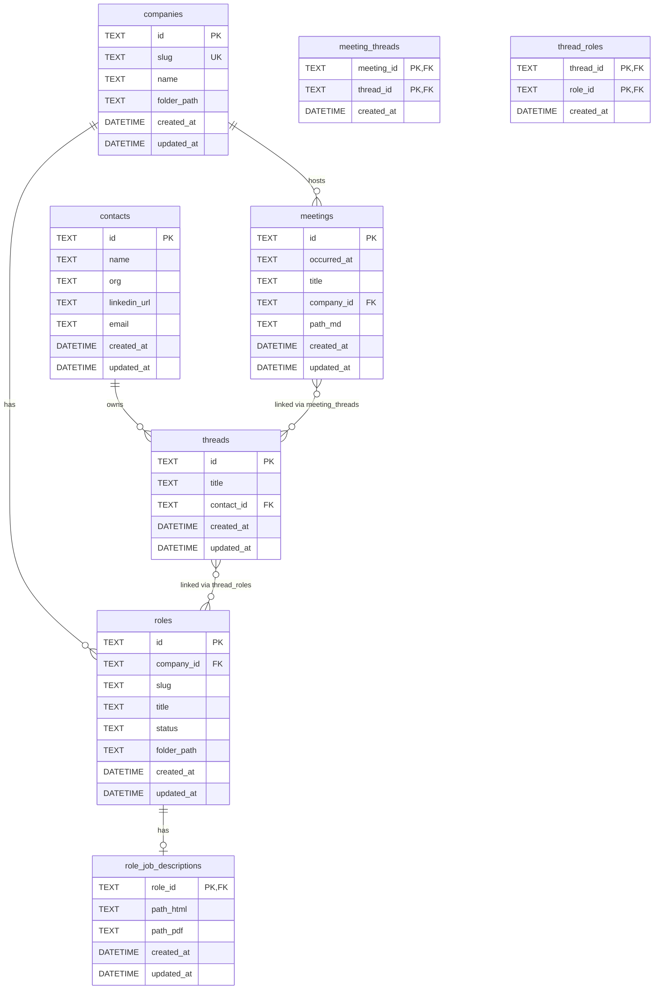

# Job Application Notes Tracker — Architecture Guide

This document provides a comprehensive overview of the repository structure, architecture, domain models, and design values for agents continuing work on this codebase.

## Purpose

A local-only Go web application for storing and retrieving job application notes and artifacts. Designed for personal use with hybrid storage: human-readable files on disk and SQLite for metadata/search.

## Quick Start

```bash
# Run the server (binds to 127.0.0.1:8080 by default)
go run ./cmd/server

# Run tests
go test ./...

# Access from other devices on LAN
JOBTRACKER_ADDR=0.0.0.0:8080 go run ./cmd/server
```

## Directory Structure

```tree
job-hunter-v2/
├── cmd/
│   └── server/
│       └── main.go              # Application entry point, dependency wiring
├── internal/
│   ├── app/                     # Application services (business logic)
│   │   ├── company_service.go   # Company + Role operations
│   │   ├── contact_service.go   # Contact operations
│   │   ├── thread_service.go    # Thread + role linking
│   │   ├── meeting_service.go   # Meeting operations
│   │   ├── jd_service.go        # Job description attachment
│   │   └── export_service.go    # JSON export
│   ├── config/
│   │   └── config.go            # Environment-based configuration
│   ├── domain/
│   │   ├── types.go             # Domain entities and RoleStatus enum
│   │   └── shortid.go           # 8-char ID generator (Crockford Base32)
│   ├── http/
│   │   ├── router.go            # Chi router setup, route definitions
│   │   ├── handlers.go          # HTTP handlers (API + HTML forms)
│   │   ├── behavioral_test.go   # End-to-end tests using httptest
│   │   └── views/
│   │       ├── views.go         # Template parsing and rendering
│   │       ├── layout.html      # Base HTML layout with nav + CSS
│   │       ├── companies.html   # Company list page
│   │       ├── company.html     # Company detail page
│   │       ├── threads.html     # Thread list page
│   │       ├── thread.html      # Thread detail page
│   │       └── role.html        # Role detail page
│   ├── infra/
│   │   ├── filestore/
│   │   │   └── filestore.go     # Filesystem operations (implements ports.FileStore)
│   │   └── sqlite/
│   │       ├── db.go            # Database connection + migration runner
│   │       ├── company_repo.go  # CompanyRepository implementation
│   │       ├── role_repo.go     # RoleRepository implementation
│   │       ├── contact_repo.go  # ContactRepository implementation
│   │       ├── thread_repo.go   # ThreadRepository implementation
│   │       ├── meeting_repo.go  # MeetingRepository implementation
│   │       ├── jd_repo.go       # JobDescriptionRepository implementation
│   │       └── migrations/
│   │           ├── 001_initial.go                    # companies, roles
│   │           ├── 002_contacts_threads_meetings.go  # contacts, threads, meetings, meeting_threads
│   │           ├── 003_thread_roles.go               # thread_roles join table
│   │           ├── 004_job_descriptions.go           # role_job_descriptions
│   │           └── 005_role_status.go                # role status column
│   ├── ports/
│   │   ├── repositories.go      # Repository interfaces
│   │   └── filestore.go         # FileStore interface
│   └── testharness/
│       └── harness.go           # Test utilities (temp DB, temp repo, HTTP client)
├── data/                        # Filesystem storage (gitignored except structure)
│   └── companies/
│       └── {company-slug}/
│           ├── company.md       # Company notes (status computed from roles)
│           ├── roles/
│           │   └── {role-slug}/
│           │       ├── job.html # Job description HTML
│           │       └── job.pdf  # Job description PDF
│           ├── meetings/
│           │   └── YYYY-MM-DD_title_<8-char-id>.md
│           └── resumes/
└── db/
    ├── index.sqlite             # SQLite database
    └── export.json              # Deterministic export
```

## Architecture

### Layered Architecture (Hexagonal/Ports & Adapters)

```diagram
┌─────────────────────────────────────────────────────────────┐
│                      HTTP Layer                             │
│  router.go, handlers.go, views/                             │
│  - Route definitions                                        │
│  - Request parsing, response rendering                      │
│  - Calls app services                                       │
└─────────────────────────────────────────────────────────────┘
                              │
                              ▼
┌─────────────────────────────────────────────────────────────┐
│                    Application Layer                        │
│  internal/app/*_service.go                                  │
│  - Business logic orchestration                             │
│  - Uses ports interfaces (not concrete implementations)     │
│  - Coordinates repos + filestore                            │
└─────────────────────────────────────────────────────────────┘
                              │
                              ▼
┌─────────────────────────────────────────────────────────────┐
│                       Ports Layer                           │
│  internal/ports/                                            │
│  - Repository interfaces                                    │
│  - FileStore interface                                      │
│  - Decouples app from infrastructure                        │
└─────────────────────────────────────────────────────────────┘
                              │
                              ▼
┌─────────────────────────────────────────────────────────────┐
│                  Infrastructure Layer                       │
│  internal/infra/sqlite/     internal/infra/filestore/       │
│  - SQLite repository impls  - Filesystem operations         │
│  - Migrations               - Creates folders, files        │
│  - Raw SQL queries          - Reads frontmatter             │
└─────────────────────────────────────────────────────────────┘
```

### Key Boundaries

| Layer | Responsibility | What it DOES NOT do |
| ------- | --------------- | --------------------- |
| `http/handlers` | Parse requests, call services, render responses | Raw SQL, file I/O |
| `app/*_service` | Business logic, validation, orchestration | HTTP concerns, raw SQL |
| `ports/` | Define interfaces | Implementation details |
| `infra/sqlite/` | SQL queries, DB operations | Business logic, HTTP |
| `infra/filestore/` | File operations | Business logic, DB access |

## Domain Models

All domain types are in `internal/domain/types.go`:

```go
// Company represents a company being tracked
type Company struct {
    ID         string
    Slug       string    // URL-safe identifier (e.g., "acme-corp")
    Name       string    // Display name
    FolderPath string    // Relative path to company folder
    CreatedAt  time.Time
    UpdatedAt  time.Time
}

// Role represents a job role at a company
type Role struct {
    ID         string
    CompanyID  string
    Slug       string     // URL-safe identifier (e.g., "senior-engineer")
    Title      string     // Display title
    Status     RoleStatus // Current status (recruiter_reached_out, hr_interview, etc.)
    FolderPath string     // Relative path to role folder
    CreatedAt  time.Time
    UpdatedAt  time.Time
}

// Contact represents a person (recruiter, hiring manager, etc.)
type Contact struct {
    ID          string
    Name        string
    Org         string
    LinkedInURL string
    Email       string
    CreatedAt   time.Time
    UpdatedAt   time.Time
}

// Thread represents a conversation/relationship container
type Thread struct {
    ID        string
    Title     string
    ContactID string    // Optional, may be empty
    CreatedAt time.Time
    UpdatedAt time.Time
}

// Meeting represents a meeting or conversation
type Meeting struct {
    ID         string
    OccurredAt time.Time
    Title      string
    CompanyID  string
    PathMD     string    // Relative path to markdown file
    CreatedAt  time.Time
    UpdatedAt  time.Time
}

// RoleJobDescription represents JD artifacts for a role
type RoleJobDescription struct {
    RoleID   string
    PathHTML string
    PathPDF  string
}
```

## Database Schema (ERD)



### Key Relationships

- **Company → Roles**: One company has many roles (1:N)
- **Role → JobDescription**: One role has at most one JD record (1:1)
- **Contact → Threads**: One contact can have many threads (1:N, optional)
- **Company → Meetings**: One company has many meetings (1:N)
- **Meeting ↔ Threads**: Many-to-many via `meeting_threads`
- **Thread ↔ Roles**: Many-to-many via `thread_roles` (idempotent linking)

## Hybrid Storage Model

| What | Where | Why |
| ------ | ------- | ----- |
| Metadata, relationships, IDs | SQLite (`db/index.sqlite`) | Fast queries, joins, search |
| Notes, artifacts | Filesystem (`data/`) | Human-readable, easy to edit, git-friendly |
| Company status | `company.md` frontmatter | Manual editing, visible in UI |
| Job descriptions | `job.html`, `job.pdf` | Preserve formatting |
| Meeting notes | `YYYY-MM-DD_title_<8-char-id>.md` | Chronological, editable, compact IDs |

## Configuration

Environment variables (all optional):

| Variable | Default | Description |
| ---------- | --------- | ------------- |
| `JOBTRACKER_REPO_ROOT` | Current directory | Root for `data/` folder |
| `JOBTRACKER_DB_PATH` | `db/index.sqlite` | SQLite database path |
| `JOBTRACKER_ADDR` | `127.0.0.1:8080` | Server bind address |

## HTTP Routes

### API Endpoints (JSON)

| Method | Path | Description |
| -------- | ------ | ------------- |
| GET | `/health` | Health check |
| POST | `/api/companies` | Create company |
| GET | `/api/companies` | List companies |
| GET | `/api/companies/{slug}` | Get company with roles/meetings |
| POST | `/api/companies/{slug}/roles` | Create role |
| POST | `/api/contacts` | Create contact |
| POST | `/api/threads` | Create thread |
| GET | `/api/threads/{id}` | Get thread with linked roles/meetings |
| POST | `/api/threads/{id}/roles` | Link role to thread |
| POST | `/api/meetings` | Create meeting |
| POST | `/api/roles/{companySlug}/{roleSlug}/jd` | Attach JD (multipart) |
| POST | `/api/export` | Export to `db/export.json` |

### HTML Pages (Server-rendered)

| Method | Path | Description |
| -------- | ------ | ------------- |
| GET | `/companies` | Company list + Add Company form |
| POST | `/companies/new` | Create company (form) |
| GET | `/companies/{slug}` | Company detail + Add Role/Meeting forms |
| POST | `/companies/{slug}/roles/new` | Create role (form) |
| POST | `/companies/{slug}/meetings/new` | Create meeting (form) |
| GET | `/companies/{companySlug}/roles/{roleSlug}` | Role detail + Attach JD form |
| POST | `/companies/{companySlug}/roles/{roleSlug}/jd` | Attach JD (multipart form) |
| GET | `/threads` | Thread list + Add Contact/Thread forms |
| POST | `/threads/new` | Create thread (form) |
| POST | `/contacts/new` | Create contact (form) |
| GET | `/threads/{id}` | Thread detail + Link Role/Meeting forms |
| POST | `/threads/{id}/roles/link` | Link role to thread (form) |
| POST | `/threads/{id}/meetings/new` | Create meeting from thread (form) |
| POST | `/export` | Export and redirect with success message |

## Design Values & Non-Negotiables

### Architecture Principles

1. **Single Responsibility**: Handlers call services; services call repos/filestore; repos own SQL; filestore owns filesystem
2. **Dependency Inversion**: App layer depends on port interfaces, not concrete implementations
3. **No raw SQL in handlers**: All DB access goes through repositories
4. **No business logic in repos**: Repos are pure data access

### Data Principles

1. **Hybrid storage**: DB for relationships/search; filesystem for human-readable content
2. **Deterministic export**: `db/export.json` should produce identical output for identical data
3. **Manual status**: Company status is edited in `company.md` frontmatter, not via API
4. **Relative paths**: All stored paths are relative to repo root

### Security & Deployment

1. **Local-only by default**: Binds to `127.0.0.1`, not `0.0.0.0`
2. **No authentication**: Designed for personal local use
3. **No external dependencies at runtime**: SQLite embedded, no external services

### Testing

1. **Behavioral tests**: Use `httptest.NewServer` with temp DB and temp repo root
2. **Test isolation**: Each test gets fresh database and filesystem
3. **Test real flows**: Tests exercise full HTTP → Service → Repo → DB path

## Testing Patterns

```go
// Example behavioral test pattern
func TestUI_CreateCompanyViaForm(t *testing.T) {
    env := testharness.New(t)  // Creates temp DB + temp repo root
    defer env.Cleanup()

    // POST form to create company
    resp := env.PostFormFollowRedirect("/companies/new", map[string]string{
        "slug": "test-company",
        "name": "Test Company",
    })

    // Assert redirect to companies list
    assert.Equal(t, http.StatusOK, resp.StatusCode)

    // Assert company folder was created
    _, err := os.Stat(filepath.Join(env.RepoRoot, "data", "companies", "test-company"))
    assert.NoError(t, err)
}
```

## Adding New Features

### Adding a new entity

1. Add domain type to `internal/domain/types.go`
2. Add migration to `internal/infra/sqlite/migrations/`
3. Add repository interface to `internal/ports/repositories.go`
4. Implement repository in `internal/infra/sqlite/`
5. Add service to `internal/app/`
6. Add handlers to `internal/http/handlers.go`
7. Add routes to `internal/http/router.go`
8. Add templates to `internal/http/views/`
9. Add behavioral tests to `internal/http/behavioral_test.go`

### Adding filesystem artifacts

1. Add method to `ports.FileStore` interface
2. Implement in `internal/infra/filestore/filestore.go`
3. Call from appropriate service

## Common Commands

```bash
# Run server
go run ./cmd/server

# Run all tests
go test ./...

# Run tests with verbose output
go test ./... -v

# Run specific test
go test ./internal/http -run TestUI_CreateCompanyViaForm -v

# Access from other devices
JOBTRACKER_ADDR=0.0.0.0:8080 go run ./cmd/server
```
