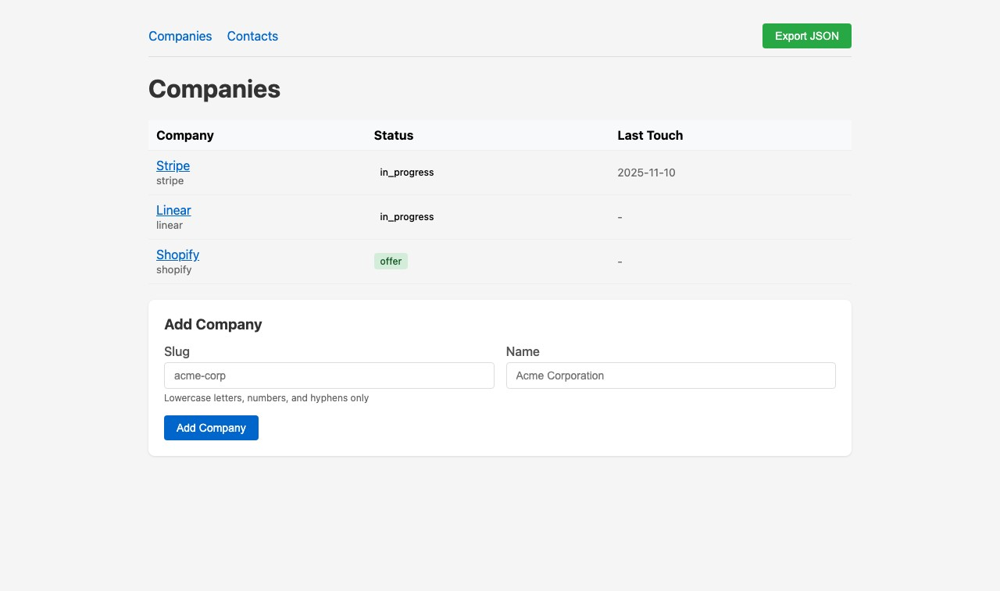
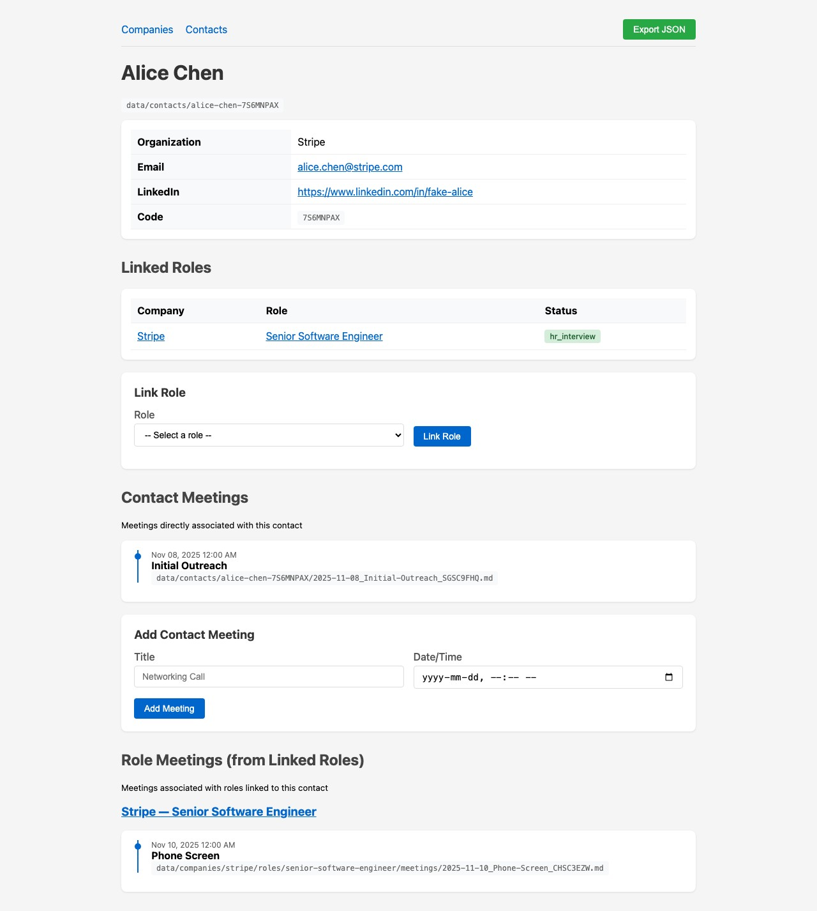

# Job Application Tracker

A personal Go web app for tracking job applications. You add companies/roles, attach contacts and link them to roles, log meetings with notes, and attach artifacts (JDs, resumes...). The UI is server-rendered HTML; there is no JS framework.

Data lives in two places: a `data/` directory of Markdown and other files you can read and edit directly, and a `db/index.sqlite` file that holds metadata and relationships for fast lookup. Company status is computed automatically from its roles — a company is `in_progress` as long as any role is still active, `offer` if all are terminal and at least one is an offer, and `rejected` otherwise.

## Run

```bash
go run ./cmd/server
# visit http://127.0.0.1:8080
```

| Variable | Default | Description |
| --- | --- | --- |
| `JOBTRACKER_REPO_ROOT` | `.` | Root for `data/` and `db/` directories |
| `JOBTRACKER_DB_PATH` | `db/index.sqlite` | SQLite path |
| `JOBTRACKER_ADDR` | `127.0.0.1:8080` | Bind address |

## Test

```bash
go test ./...
```

## Screenshots





More screenshots (company detail, role detail) in [`docs/screenshots/`](docs/screenshots/).
